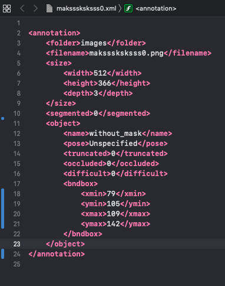
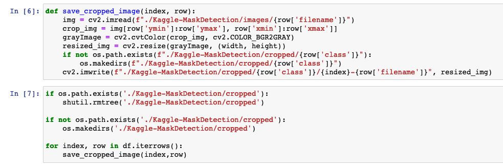

    APA references
    Summarize your business problem/hypothesis
    Walk through your method
    5-8 Pages, 4000-8000 words
    Up to 3 Illustrations @ ¼ page each
    Up to 1 Illustration @ ½ page
    PDF
    1 Appendix
    Submit your 10 questions

# Problem

One of the best ways to fight Covid-19 is to simply wear a mask when out in public. This is true because it is a small step that everybody can do. In addition to masking up in the general public, (which ought to be happening anyways), there are locations where masks are required, and also must be work correctly. Common examples include hospitals, but could also include standard retail stores. As of right now, it is responsibility of employees to detect if a person is wearing a mask, and if they are wearing it correctly. 

Luckily, a decent amount of the detection process can, in theory, be handed off to a well-trained machine learning model. Many businesses already have cameras monitoring the interior of said business, so it would be useful if they could be used to help boost public safety, and monitor mask wearing.

# Hypothesis

I hypothesize that an image classification model can be trained to detect not only the difference between a masked individual and an unmasked individual, but it can also predict if a person is wearing a mask incorrectly or not.

# Dataset

The dataset that will be used for training and testing a model can be found at the following URL:

	https://www.kaggle.com/andrewmvd/face-mask-detection
	
This dataset contains 853 images, each of which contains images of at least one person’s face. These faces fall into one of three categories:

- mask_weared_incorrect
- with_mask
- without_mask

Each image has an associated annotation file, which is in .xml format. An example is shown here:

There is a bit of extra information in this dataset that is of little use to us, such as the “segmented” field, or the “pose”, “truncated”, “occluded”, or “difficult” fields. The data that will be useful is:

- filename: which image does this annotation correspond to
- size: dimensions of the source image
- name: classification of the person in the image
- bandbox: tells us what portion of the image contains the face in question. 

Given this information, and the images for analysis, the next stage in the data pipeline is to prepare the data for analysis.

# Data Preparation

In order to load the annotation data, it was decided that a convenient way to store the data would be a simple .csv file. There are plenty of ways that one may accomplish this task, but for this project, a Powershell script was used. It loops through  each annotation file, and within each file, it then loops through each <object> node, creating a new .csv entry with each iteration. It does this by creating a new pscustomobject with specific properties, and sending it down the pipeline.

After running this step, it was found that the original dataset of 853 images contained 4072 total faces.

Given this csv, the next step of the data cleaning process is to grab the faces from the original images, and save these cropped faces to a separate directory. I decided to use cv2 for this project, as it seems like an excellent library for image manipulation. I wrote some code that makes a directory if it does not exist already, and saves a cropped and resized version of the original image to that directory.

I also went ahead and stripped out the color from the image, as it is likely not necessary for determining the presence of a mask. I could also see it having an impact on the predictions if   a person was wearing an uncommonly colored mask. 

Given this collection of images, I then needed to convert each one to a 2-dimensional numpy array, and flatten it into a 1-dimensional vector. This vector will serve as the input for a tensor flow model, so each input vector needs to be the same size.

# Model Fitting

(Work in Progress)

# Results

(Work in Progress)

# Conclusion

(Work in Progress)

# References

Academy, Pink. “Wolrd’s Most Complete Masked Face Recognition Dataset Is for Free.” Medium, 16 July 2020, https://medium.com/the-programming-hub/wolrds-most-complete-masked-face-recognition-dataset-is-for-free-10d780eed512.

    A large dataset of images of people wearing masks and not wearing masks. Seems to come from China, as the readme is in Chinese.

“Applications in Response to COVID-19: Mask Detection.” Deep Learning, https://blogs.mathworks.com/deep-learning/2020/06/11/mask-detection-using-deep-learning/. Accessed 16 Jan. 2021.

    A blog post from the mathworks team about their efforts to create a mask detection model. Uses MatLab model, rather than a traditional Tensorflow model for training and inference.

“COVID-19: Face Mask Detector with OpenCV, Keras/TensorFlow, and Deep Learning.” PyImageSearch, 4 May 2020, https://www.pyimagesearch.com/2020/05/04/covid-19-face-mask-detector-with-opencv-keras-tensorflow-and-deep-learning/.

    Provides source code for a mask detection algorithm that can function on images and video streams. Details the entire image processing pipeline, which includes detection of faces, and the serialization of those faces into the model for inference. 

Escarlate, Alberto. “My Quarantine Project: A Real-Time Face Mask Detector Using Tensorflow.” Medium, 16 June 2020, https://towardsdatascience.com/my-quarantine-project-a-real-time-face-mask-detector-using-tensorflow-3e7c61a42c40.

    Describes the efforts of one person’s quarantine project to build a mask detection algorithm. Tensorflow is used, but no source code is provided.

Face Mask Detection. https://kaggle.com/andrewmvd/face-mask-detection. Accessed 16 Jan. 2021.

    Data source for face mask images. Contains images of not only mask/maskless people, but also of subjects who are wearing a mask incorrectly. Could be used to make a more nuanced classifer.

Face Mask Detection in Street Camera Video Streams Using AI: Behind the Curtain | Tryolabs Blog. https://tryolabs.com/blog/2020/07/09/face-mask-detection-in-street-camera-video-streams-using-ai-behind-the-curtain/. Accessed 16 Jan. 2021.

    Describes a technique for face mask detection that detects human poses, then human faces, and then detects if a mask is being worn. Starting from human poses is useful for surveillance footage.

“Face Mask Detection with ML/AI on Cisco Industrial Hardware.” Cisco Blogs, 25 Aug. 2020, https://blogs.cisco.com/internet-of-things/face-mask-detection-with-ml-ai-on-cisco-industrial-hardware.

    A developer at Cisco describes his attempt at making a mask classifer. A link to a docker image is given.

“How to Build a Face Mask Detector Using RetinaNet Model!” Analytics Vidhya, 24 Aug. 2020, https://www.analyticsvidhya.com/?p=69192.

    Provides a fairly in-depth explanation for the math and architecture behind RetinaNet, and justifies its use for this application.

“Implementing a Real-Time, AI-Based, Face Mask Detector Application for COVID-19.” NVIDIA Developer Blog, 18 Aug. 2020, https://developer.nvidia.com/blog/implementing-a-real-time-ai-based-face-mask-detector-application-for-covid-19/.

    Provides a developer recipe for how one would build a mask detection model for use in healthcare facilities. 	

Loey, Mohamed, et al. “A Hybrid Deep Transfer Learning Model with Machine Learning Methods for Face Mask Detection in the Era of the COVID-19 Pandemic.” Measurement, vol. 167, Jan. 2021, p. 108288. PubMed Central, doi:10.1016/j.measurement.2020.108288.

    Researchers made a model for mask detection. Results are published with helpful graphs that would be helpful for informing how I would like to disply the information at the end of this project.

Mujtaba, Hussain. “Real-Time Face Recognition| Real Time Face Recognition OpenCV Python.” GreatLearning, 14 Jan. 2021, https://www.mygreatlearning.com/blog/real-time-face-detection/.

    Describes an implementation of mask detection using the OpenCV library. This library is useful for face detection in general, but also can help with mask detection.

“(PDF) A FACEMASK DETECTOR USING MACHINE LEARNING AND IMAGE PROCESSING TECHNIQUES.” ResearchGate, https://www.researchgate.net/publication/345972030_A_FACEMASK_DETECTOR_USING_MACHINE_LEARNING_AND_IMAGE_PROCESSING_TECHNIQUES. Accessed 16 Jan. 2021.

    Describes a mask detection model that was constructed using keras. Several different types of Neural Networks were used and compared.

